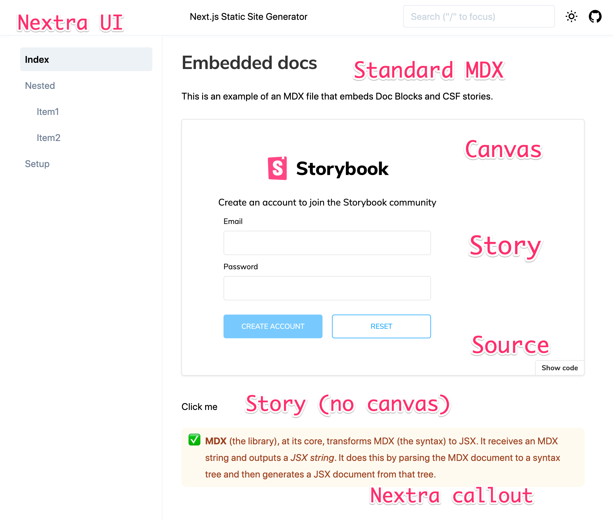

# Storybook Docs 2.0 Prototype



This prototype illustrates two new key ideas that we're planning for Storybook Docs 2.0:

- Reuse stories outside of storybook
- Reuse docs outside of storybook with MDX 2.0

This is throwaway code that's for feedback only. It's not intended to be consumed or built upon.

## Running the example

To run the example:

```sh
yarn && yarn dev
```

This is using server-rendered react components. The source is visible in:

- Portable docs: [index.mdx](./pages/index.mdx)
- Standard CSF: [AccountForm.stories.tsx](./components/AccountForm.stories.tsx)
- Setup code: [\_app.js](./pages/_app.js)

## Reuse stories outside of Storybook

In Docs 2.0, you can reuse stories outside of Storybook.

Storybook Docs makes it easy for developers to document components as they build. However, many teams have other requirements, such as more customized branding, integration with existing documentation systems, easier authoring for non-technical teammates and so-forth.

Docs 2.0 will make it easy to document components both inside AND outside of Storybook depending on your needs.

This example is Nextra/NextJS, but it could just as easily be Docusaurus, Gatsby, or your CMS of choice. The current constraint is that Storybook's Doc Blocks are React components, and utilize React Context (introduced in React 16.8).

The programming model is that you wrap a page in a `DocsProvider` wrapper, and then you can use any of the doc blocks (`Story`, `Canvas`, `Source`, `Description`, and so on). The Doc Blocks access the `DocsContext` which is an API for interacting with Storybook embedded in your application.

Here's what that looks like:

```jsx
import { DocsContainer, Story } from '@storybook/blocks';
import meta, { Standard } from '../components/AccountForm.stories';

export default () => (
  <DocsContainer>
    <Story of={Standard} meta={meta} />
  </DocsContainer>
);
```

## Reuse docs outside of Storybook with MDX 2.0

In Docs 2.0, you can also reuse your documentation outside of Storybook.

Consider a small team building out its design system. Storybook helps them get off the ground quickly, giving them documentation best practices out of the box using [MDX and Doc Blocks](https://storybook.js.org/docs/react/api/mdx). As the project matures, they want to release their documentation publicly in a fully custom, branded documentation system based on the technology of their choice.

In Storybook Docs 1.0, this workflow was not possible. The MDX implementation was tied to Storybook's runtime. When you defined stories in Docs 1.0 MDX, you needed a special webpack loader to process the files. And the Docs rendering was tightly coupled to Storybook's runtime.

In Docs 2.0, we're redesigning the system so that we're using portable standard MDX that's supported by many modern CMS's like NextJS, Gatsby, and Docusaurus. So you can build your docs out in Storybook, reuse them in an external documentation system.

The key change is that you no longer define stories in MDX. Instead, you define them in [Component Story Format (CSF)](https://storybook.js.org/docs/react/api/csf), and them reference them from MDX. Here's what that looks like in code:

```js
import { Meta, Story, Canvas } from '@storybook/blocks';
import meta, { Standard } from '../components/AccountForm.stories';

<Meta of={meta} />

<Canvas>
  <Story of={Standard} />
</Canvas>
```

There's a lot going on here. If you've used [MDX and Doc Blocks](https://storybook.js.org/docs/react/api/mdx) this should look pretty familiar. What's different is that you're importing the default export as `meta` and defining it for the whole file with a `Meta` block. Then for each story, you're rendering it using the `Story` block.

This new, portable, format is not only a win from a documentation reuse standpoint. By doubling down on CSF, we are also simplifying our entire toolchain including the building and testing part of the workflow.

## Next steps

This prototype is missing many key pieces.

Firstly, it doesn't use Storybook's runtime for Args, Controls, and so forth. We will build this out in the coming weeks and months.

After we have a working demo, we will also rewrite Storybook docs to use the new blocks. This way, the code that's running in Storybook will be nearly identical to the code that's running in your custom docs site.

Finally, there are other aspects to Docs 2.0 that are not described here, including but not limited to, an updated UI and updated runtime data structure.

## Feedback

We're interested to hear your feedback on this direction for Storybook Docs. If you have questions or ideas, please reach out directly to Michael Shilman (`@mshilman` on Twitter), or chat in the `#addon-docs` channel in the Storybook Discord https://discord.gg/storybook.
